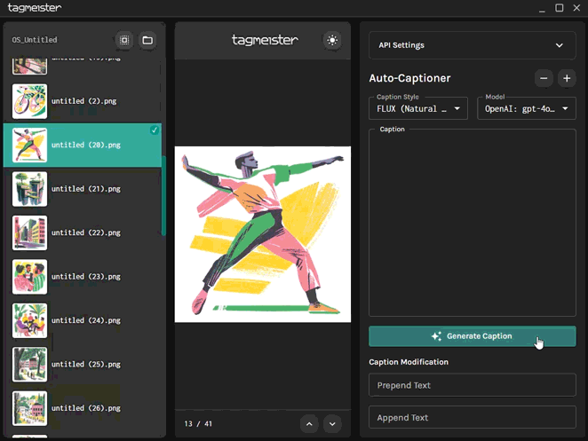

# tagmeister 

A Windows desktop application for efficient image captioning using OpenAI, Anthropic, or local models via Ollama and LM Studio.  
tagmeister helps you organize and caption your datasets with ease.

---



## Features

- Browse and view images from any directory
- Generate AI-powered image captions using GPT models (OpenAI, Anthropic, Ollama, LM Studio)
- Choose between cloud (OpenAI, Anthropic) and local (Ollama, LM Studio) captioning backends
- Edit captions manually, save captions automatically
- Keyboard shortcuts for efficient navigation
- Batch processing support
- Resizable panels for customizable layout

## Requirements

- Windows 10 or later
- For cloud captioning: OpenAI or Anthropic API key
- For local captioning: [Ollama](https://ollama.com/) and/or [LM Studio](https://lmstudio.ai/) installed (if using local models)
- **CORS must be enabled on your LM Studio server and Ollama for local models to work.**  
  [How to enable CORS for Ollama](https://objectgraph.com/blog/ollama-cors/)

## Installation

1. Download the latest release (`tagmeister-portable.exe`)
2. Run the executable (no installation required)
3. Enter your API key(s) in the settings (OpenAI and/or Anthropic, if using cloud models)
4. (Optional) Install Ollama or LM Studio for local model support  
   **Important:** Make sure CORS is enabled on your LM Studio server and Ollama.  
   [How to enable CORS for Ollama](https://objectgraph.com/blog/ollama-cors/)
5. Start captioning your images!

## Development Setup

```bash
# Clone the repository
git clone https://github.com/yourusername/tagmeister.git

# Navigate to the project directory
cd tagmeister

# Install dependencies
npm install

# Run the app in development mode
npm run tauri dev
```

## Building

To build a release version for Windows:

```bash
npm run tauri build
```

## Usage

1. Click the folder icon to select an image directory
2. Select images from the left panel
3. Choose your preferred captioning backend in the settings (OpenAI, Anthropic, Ollama, or LM Studio)
4. Click "Generate" to create AI captions
5. Edit captions as needed
6. Captions are automatically saved as `.txt` files alongside your images

## Privacy & Security

- API keys are stored locally in app preferences
- No data is sent to external servers except to the selected AI backend (OpenAI, Anthropic, or your local Ollama/LM Studio instance)
- All image processing is done locally except for caption generation via cloud APIs

## Contributing

Contributions are welcome! Please feel free to submit a Pull Request.

---
